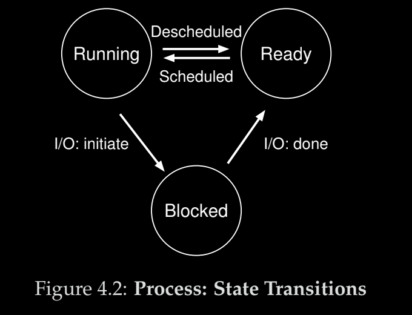
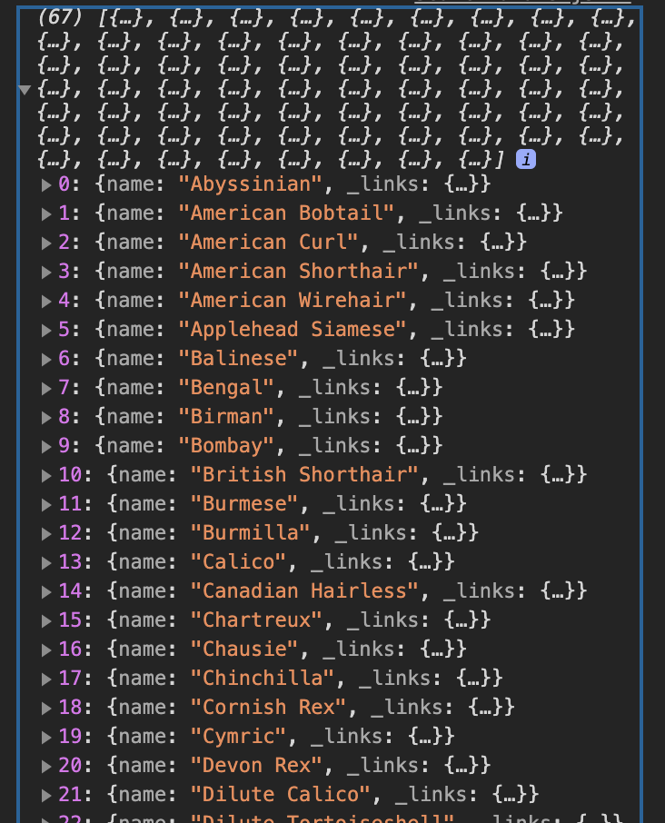

> I'd recommend just searching for things you need here
> Big tip: on a mac you can use control + cmd + space to insert emojis ⛹🏽⛹⛹

> Where I'm at now:
> Frontend: Web components
> Backend: OS

# Backend:
### Internet 
- Internet https://www.youtube.com/watch?v=x3c1ih2NJEg :heavy_check_mark:
  - protocols:
      - TCP/IP: Transports data
      - Http/https: Web access
      - RTP: Live video, Streaming and VOIP
- HTTP https://www.youtube.com/watch?v=eesqK59rhGA
  - Stateless and connectionless: the client and server don't keep any kind of state or connection to remember each other
  - Request/Response structure: 
    - Startline: GET posts/specialPost, of the format, method URI, all the headers have MIME types
    - Body
    - Headers
      - MIME Types: just a standardized format for http header types : https://stackoverflow.com/questions/3828352/what-is-a-mime-type/3828381
- Browsers https://www.youtube.com/watch?v=WjDrMKZWCt0 :heavy_check_mark:
  - User Interface 
  - Broswer engine
    - V8 https://www.youtube.com/watch?v=KM9coMpy5sQ&loop=0  :heavy_check_mark:
      - Diagram https://hackernoon.com/hn-images/1*N6eUu1Wy0xyu7dR54Pn5bQ.png :heavy_check_mark:
  - Rendering engine
    - Networking
    - JS interpreter
    - UI backend
  - Data persistence
- DNS & Domain name https://www.youtube.com/watch?v=mpQZVYPuDGU :heavy_check_mark:
  - Servers involved(in order)
    - Resolver/ ISP (has a caching layer)
    - TLD
    - Root server
    - Authoriative name server
  - Top level domain name : .io
  - Second level domain name : vigneshkarthikeyan
  - Sub domain : Subdomain
- Hosting https://www.youtube.com/watch?v=0hGK7qiQ6WA :heavy_check_mark:
- SSL https://www.youtube.com/watch?v=rROgWTfA5qE&loop=0 :heavy_check_mark:

### Basic Front End
- HTML https://www.youtube.com/watch?v=UB1O30fR-EE :heavy_check_mark:
  - Inline vs block level elements
  - < !DOCTYPE html >
- CSS https://www.youtube.com/watch?v=yfoY53QXEnI :heavy_check_mark:
  - Selector { property: value; } 
    - .class-name{ } for classes
    - *{ } for everything
    - **grail** has every other selector: CSS game http://flukeout.github.io/ :heavy_check_mark:
  - Box model, from inside to out: 
    - Content
    - Padding : TRBL 
    - Border
    - Margin : TRBL 
  - *advanced* Sass Course https://www.youtube.com/watch?v=IFM9hbapeA0&list=PLillGF-Rfqba3xeEvDzIcUCxwMlGiewfV&loop=0
- Flexbox
  - https://css-tricks.com/snippets/css/a-guide-to-flexbox/  :heavy_check_mark:
    - Flex-flow is shorthand for flex-direction and flex-wrap
  - **Grail** https://flexboxfroggy.com/ :heavy_check_mark:
- Responsive Design https://www.youtube.com/watch?v=fgOO9YUFlGI&list=PLoYCgNOIyGABDU532eesybur5HPBVfC1G&index=9&loop=0  :heavy_check_mark:

### OS and General Knowledge < DO THIS!
- OStep, skim this: https://drive.google.com/file/d/1iPD0JzZ5OSvIS03e_PkymYf4ySEeGjQX/view?usp=sharing (you are on chapter 11)
    - How do OSes work? Virtualization, Concurrency and Persistence  :heavy_check_mark:
    - Process Management
      - Process API: Create, Destroy, Stop, Start, Wait, Status.
      - Create: Modern OSes lazy load the important bits of an EXECUTABLE program from an SSD into memory
      - Memory Allocation in the form of a heap(user allocated, ex: malloc) and a stack(stores argc and argv array on initialization). 
        - requires Paging and Swapping.
      - Each process has 3 file descriptors STDERR, STDIN, STDOUT
      - Process states: 
        - running
        - blocked 
        - ready
        
      - Some OS APIs
        - fork() - creates a parallel process of the program which it was called from
        - wait() - let's the parent wait for the child process to finish(also provides determinism)
        - exec() - runs a different program using the same process
    - Threads and Concurrency
      
    - Memory Management
      - Heap
        - malloc() stores in heap, free() releases it
        - How can i not call free() when I run a short-lived program?
          - Well, the OS gives you two abstract layers of the memory, some for the process AND some within each process. So for shorter-lived programs not calling free is okay because the OS frees the process and the heap was created in the second level of abstraction, the per process memory. 
      - Segmentation 
        - Storing Code, Stack and Heap in ways that allow minimal space wastage
        - Paging 
          - Storing data in pages
        - Swap space
          - Location of virtual memory save to swap pages 
      - Page fault
        - When a page is not available in virtual memeory it looks send a page fault or a page not available and fetches the page from the physical memory
      - Pages are replaces as required using a page replacement policy
      - Workloads of policies and their performance
        - No locality
        - 80-20 workload
        - looping workload
      - TLB
        - provides the system with a small hardware cache of address translations
      - Address translations
        - Converts memory addresses to physical addresses
    - Interprocess Communication
    
    - I/O Management
    
    - POSIX? 
      - standards that ensure compatibility when moving between OSes
      - stdin, stdout, stderr and pipes: https://www.howtogeek.com/435903/what-are-stdin-stdout-and-stderr-on-linux/
      - Unix v. Linux, neither are OSes: 
      - Unix: Solaris, BSD, MacOS
        - an entire OS
      - Linux: Ubuntu, fedora, debian, android
        - just a kernel that is "distro"'d.
    - Terminal commands: 
      - grep
      - awk
      - sed
      - lsof
      - curl
      - wget
      - tail
      - head
      - less
      - find
      - ssh 
      - kill

### Learn a language
Haha idk, JS isn't too hard to learn, maybe look for a course online for the viewers

### Relational databases
MySQL: https://www.udemy.com/course/mysql-and-sql-from-beginner-to-advanced/learn/lecture/5050050#overview
probably should learn Postgres at some point.

# FrontEnd

### Internet :heavy_check_mark:

### HTML
Semantic HTML 
- https://www.lifewire.com/why-use-semantic-html-3468271 *TODO*
Forms and validation:
- not sure what i don't know here
Conventions and best practices: 
- same^
Accessibility: 
- ?
SEO Basics: 
- ?

### CSS
Responsive design and media queries: https://www.youtube.com/watch?v=fgOO9YUFlGI&list=PLoYCgNOIyGABDU532eesybur5HPBVfC1G&index=9&loop=0  *review*
FEM: CSS course and 

### JS
Fetch api
- Axios

### Version Control :heavy_check_mark:

### Web security
- Not done much besides owasp, cors and https, do more of the latter two(check out the guide from the backend section)

### CSS Architecture
- BEM
  - v good: https://youtu.be/er1JEDuPbZQ

### CSS Preprocessor
- Sass
  -  https://www.youtube.com/watch?v=Zz6eOVaaelI :heavy_check_mark:
  - Don't try and use it. CSS in is is so much more intuitive.

### Build Tools
#### Task Runners
Npm scripts :heavy_check_mark:

#### Module bundlers
Parcel baby!

#### Linters and formatters
- Prettier plugin
- eslint files or jetbrains plugin

### Pick a Framework : React
FEM React https://btholt.github.io/complete-intro-to-react-v5/
  - useEffect hook , need to declare dependencies or it will 'useEffect' every time render is called.
  - dropdowns are great for custom hooks
  - useEffect replaces the lifecycle methods
  - general js, but if you get a map back that looks like :
    

  
  you can get just the names from it by using destructuring:
  const breedStrings = breeds.map(({name}) => name)
  
  - One-way data flow: children never cause parents problems, just like real life, amiright?
  - Arrow functions and this in component lifecycle.
  - static getDerivedStateFromProps, takes in a set of props and gives you a new set of state. 
  - Need an event listener? use arrow functions and you won't need a bind
  - Modals are what popups that ask are you sure are called.
    - Trap focus of a modal: https://tinloof.com/blog/how-to-create-an-accessible-react-modal/
  - **grail** All of the advanced topics(16+) here are siloed so you can just use what you need(redux, TS, testing): https://btholt.github.io/complete-intro-to-react-v5/
    - If you want to learn anything, download the parent repo from the master branch and each section uses that as a fresh start.
   - Redux saga is for async use of redux
   - **grail** super useful break up of what react is and what it's not(as opposed to angular).: https://amp.reddit.com/r/webdev/comments/clghfx/angular_vs_react_which_would_you_choose_in_2019/

#### State management
- need to do the FEM Redux course
- Context :heavy_check_mark:

### Modern CSS
- find a class on emotion

# Bonus(Common to both)
- How people are using lodash:
   - "I don't use it for chain, clone, each, map, filter, or reduce.

I still use it for at, has, chunk, groupBy, uniqBy, intersection, flatten, cloneDeep, debounce"
- AWS Security **grail** https://www.youtube.com/watch?v=-ObImxw1PmI
  - This thing actually went over internet gateways as well! and VPC, KMS, and IAM.
- EPI: https://drive.google.com/file/d/1xtKQE5VLdY8AUsAJDKr-dAjLcEkhv6J1/view
- AWS webdev, **grail** https://www.udemy.com/course/networking-in-aws/
- *Bonus* Networking https://www.homenethowto.com/
- Subnets https://docs.aws.amazon.com/vpc/latest/userguide/VPC_Subnets.html
- Security https://expeditedsecurity.com/api-security-best-practices-megaguide/
- AWSinPlainEnglish  https://expeditedsecurity.com/aws-in-plain-english/
  - checkout waf
- find out what those old tunnel files are/did (from oldStuff)
- learn about message queues and use them better
- Distributed auth
  - AuthO : This is basically just an embeddable login blade
  - Passport : Auth with other stuff. 
  - command + 1 to open project in webstorm and command + n to open a new file. 
  - JWT :
    - https://www.youtube.com/watch?v=894seNhONF8&loop=0 :heavy_check_mark:
    - https://www.youtube.com/watch?v=2jqok-WgelI&loop=0 (use this for sessions)
    - Lookup refresh tokens and all that, extending token length https://stackoverflow.com/questions/26739167/jwt-json-web-token-automatic-prolongation-of-     expiration?rq=1
  - **Holy Grail** Distributed/ Load balanced servers and need to keep servicing Request with JWT(in English, if you have multiple servers, the server keeping track of the auth might not be the same server that has low load and will serve a future request. so you just share have a **shared secret**. The private key for the jwt). This apparently is called symmetric encryption. 
  - Refresh tokens: https://auth0.com/blog/refresh-tokens-what-are-they-and-when-to-use-them/
- Watch tech interviews: https://interviewing.io/recordings/
- JS runtime environment: https://medium.com/@olinations/the-javascript-runtime-environment-d58fa2e60dd0
- JS memory model: https://medium.com/@ethannam/javascripts-memory-model-7c972cd2c239#:~:text=For%20the%20purposes%20of%20this,in%20addition%20to%20function%20calls).&text=Now%2C%20the%20heap.,where%20non%2Dprimitives%20are%20stored.
- API Security: https://expeditedsecurity.com/api-security-best-practices-megaguide/
- Cookies, sessions and it not being RESTful and why you should still do it: https://stackoverflow.com/questions/6068113/do-sessions-really-violate-restfulness 
- Alternative roadmap, this kinda includes both: https://www.youtube.com/watch?v=IFM9hbapeA0&list=PLillGF-Rfqba3xeEvDzIcUCxwMlGiewfV&loop=0
- Regex: https://www.regular-expressions.info/quickstart.html
- All my flashcards: https://www.cram.com/dashboard-flashcards#flashcards
- A lot of content for my PM interviews and other stuff in Onenote 
- Tf is a polyfill/ How do I get old browsers to run my code(ans, transpile for the new stuff, polyfills for classes : https://medium.com/hackernoon/polyfills-everything-you-ever-wanted-to-know-or-maybe-a-bit-less-7c8de164e423#.p1y2v1ujy
- CORS: 2nd comment https://www.reddit.com/r/javascript/comments/8rn8ja/i_dont_understand_how_cors_works/
  - only done by the browser, so postman/fetch all that works.
  - Origin refers to the (i think at the website level, a different website) thing that is different from the endpoint. bleh.
  - looks 
- SASS: *Grail* Use SASS it's easy https://www.youtube.com/watch?v=Zz6eOVaaelI
  - Mixin: Just like functions, you could use a *mixin* to set the default properties for flexbox: display, justify-content, align-items @12:00
    - Damn, it's so goooood. You can even pass it variables and set flex-direction dynamically if you want.
- Emmet: *Grail* Want to get better with code completion, this is how it's done!
- ESLint: npm i -D eslint eslint-config-prettier (more for syntax)
- package-lock.json: for production releases. packages can be installed using npm ci and will result in exact version rather than ^***

